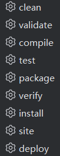

# 1 Maven介绍
## 1.1 Maven两大功能
### 1.1.1 项目构建
#### Maven构建项目特点：
Maven可以将传统的项目构建标准化，每个阶段用一个命令完成。
##### 1、Clean 生命周期：

clean：删除目标目录中的编译输出文件。这通常是在构建之前执行的，以确保项目从一个干净的状态开始。
##### 2、Default 生命周期（也称为 Build 生命周期）：

validate：验证项目的正确性，例如检查项目的版本是否正确。

compile：编译项目的源代码。

test：运行项目的单元测试。

package：将编译后的代码打包成可分发的格式，例如 JAR 或 WAR。

verify：对项目进行额外的检查以确保质量。

install：将项目的构建结果安装到本地 Maven 仓库中，以供其他项目使用。

deploy：将项目的构建结果复制到远程仓库，以供其他开发人员或团队使用。

##### 3、Site 生命周期：

site：生成项目文档和站点信息。

deploy-site：将生成的站点信息发布到远程服务器，以便共享项目文档。



#### 与其他项目构建工具对比
1.Ant:Ant没有依赖管理功能.

2.Gradle：在Maven Apache的基础上引入了基于Groovy的特定领域语言。
### 1.1.2依赖管理
#### 传统
手动拷贝jar包

1.容易版本冲突；
2.难以寻找；
3.添加麻烦。
#### Maven
在pom.xml文件中添加jar包坐标，Maven会自动从仓库中下载
1.一步构建；

2.方便管理；

3.支持跨平台。

# 2 Maven仓库
## 2.1 本地仓库
本地仓库，在第一次执行 maven 命令的时候才被创建。

运行 Maven 的时候，Maven 所需要的任何构件都是直接从本地仓库获取的。如果本地仓库没有，它会首先尝试从远程仓库下载构件至本地仓库，然后再使用本地仓库的构件。

默认情况下，不管 Linux 还是 Windows，每个用户在自己的用户目录下都有一个路径名为 .m2/repository/ 的仓库目录。

## 2.2 远程仓库
### 2.2.1 中央仓库
 中央仓库是由 Maven 社区提供的仓库，其中包含了大量常用的库。
 https://repo.maven.apache.org/maven2/

### 2.2.2 私服仓库
局域网架设私有仓库服务器，常用于企业开发。

### 2.3 替换仓库至阿里云
中央仓库的服务器在国外，国内进行访问下载速度较慢，可以替换为阿里云的镜像仓库。

修改 maven 根目录下的 conf 文件夹中的 settings.xml 文件，在 mirrors 节点上，添加内容如下：

```
<mirror>
  <id>aliyunmaven</id>
  <mirrorOf>*</mirrorOf>
  <name>阿里云公共仓库</name>
  <url>https://maven.aliyun.com/repository/public</url>
</mirror>
```

如果想使用其它代理仓库，可在 <repositories></repositories> 节点中加入对应的仓库使用地址。以使用 spring 代理仓为例：

```
<repository>
  <id>spring</id>
  <url>https://maven.aliyun.com/repository/spring</url>
  <releases>
    <enabled>true</enabled>
  </releases>
  <snapshots>
    <enabled>true</enabled>
  </snapshots>
</repository>
```

# 3 核心文件pom.xml
## 3.1 示例文件
```pom.xml
<?xml version="1.0" encoding="UTF-8"?>

<project xmlns="http://maven.apache.org/POM/4.0.0"
         xmlns:xsi="http://www.w3.org/2001/XMLSchema-instance"
         xsi:schemaLocation="http://maven.apache.org/POM/4.0.0 http://maven.apache.org/xsd/maven-4.0.0.xsd">
<!--    Maven模型版本-->
    <modelVersion>4.0.0</modelVersion>
<!--组织标识-->
    <groupId>com.darkyellowcat</groupId>
<!--项目标识-->
    <artifactId>untitled</artifactId>
<!--    版本号-->
    <version>1.0-SNAPSHOT</version>
<!-- 项目依赖-->
    <properties>
        <maven.compiler.source>8</maven.compiler.source>
        <maven.compiler.target>8</maven.compiler.target>
        <project.build.sourceEncoding>UTF-8</project.build.sourceEncoding>
    </properties>

</project>
```
## 3.2 Maven坐标
Maven通过groupId，artifactId，version三个字段来获取坐标，进而获得jar包。