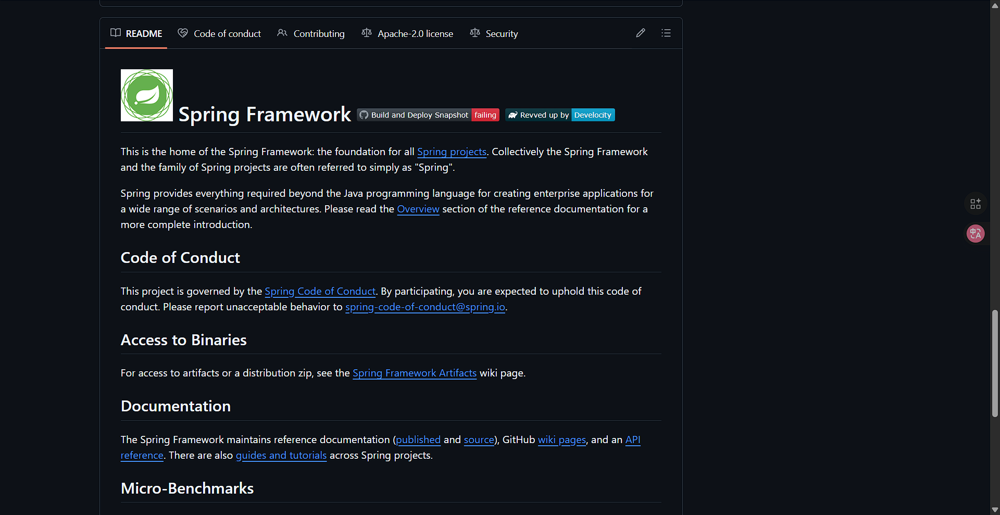
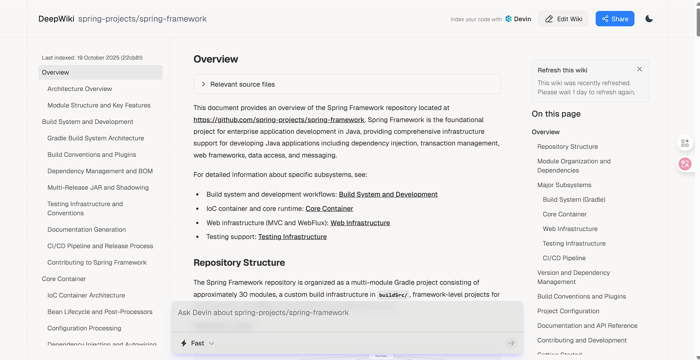

# 引言
在 GitHub 上，我们经常会遇到一个共同的问题：**项目结构太复杂，源码难以理解**。而 DeepWiki 正是为了解决这个痛点而诞生的一个开源导航与推荐工具。它通过算法与人工整理相结合，帮助开发者快速解析 GitHub 项目、文档和资源。

# 正文

## 简介
**DeepWiki** 是一个聚焦于 GitHub 的“项目百科全书”，它从开源生态中自动抓取并解析优质项目，帮助开发者探索、学习与贡献。

它不仅仅是一个项目索引网站，更像是一个面向开发者的知识图谱平台，让你能在更短时间内发现优秀的轮子和前沿技术。

主要特点包括：
- 操作简洁
- 清晰的界面设计与标签导航  
- 高质量项目解析功能 

## 核心功能

1. **智能推荐**  
   DeepWiki 利用算法从 GitHub 数据中挖掘高活跃度、高质量的项目，避免信息噪声，让用户更容易发现真正值得关注的仓库。

2. **项目百科页**  
   每个项目页面不仅展示仓库信息，还包含简明的技术介绍、相关项目推荐以及技术栈标签，帮助你快速了解一个项目的全貌。

3. **主题导航与技术地图**  
   用户可以按主题（如“AI”、“Web”、“Database”、“Security”）浏览项目，形成知识体系化的视图，便于系统学习。

4. **趋势追踪与时间线**  
   DeepWiki 追踪项目的活跃度与更新时间，提供类似“今日热门”、“本周上升榜”等趋势榜单，帮助开发者掌握社区动态。

## 使用指南

将 http://github.com替换 为http://deepwiki.com
列如：https://github.com/spring-projects/spring-framework -> https://deepwiki.com/spring-projects/spring-framework

 ->

## 总结
DeepWiki 是一个极具潜力的开源项目导航与探索平台，对于经常逛 GitHub 的开发者而言，它能大大理解成本，帮助你快速了解技术生态、发现优秀项目。

无论你是想找灵感、学习新框架，还是参与开源贡献，DeepWiki 都是一个不可错过的工具。

> 🌐 官方网站：[https://deepwiki.org/](https://deepwiki.org/)
>  
> 💡 适合人群：开发者、开源爱好者、学习者
>  
> 🧭 一句话总结：**让 GitHub 的知识图谱更清晰，让探索更高效。**

