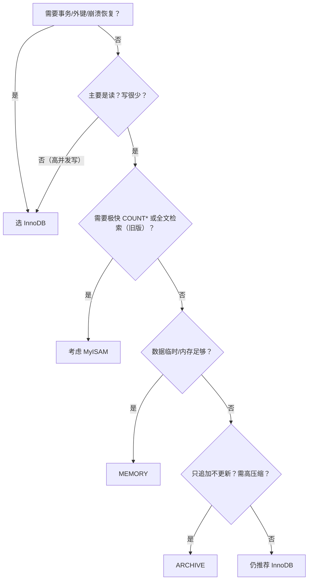

# 数据库操作

## 创建
名称若为关键词需用单引号
```
CREATE DATABASE [IF NOT_EXISTS] XX
```
## 查看/删除
```
SHOW DATABASES 查看数据库
SHOW CREATE DATABASE XXX 数据库创建语句
DROP DATABASE [IF EXITS] XX 删除数据库
```
## 备份恢复
必须在DOS执行
备份
```
mysqldump -u * -p * -B 数据库
```
生成 xx.sql文件
恢复
```
Source xx.sq了、

```
# 表操作

## 创建表
```
CREATE TABLE table_name
{
    field datatype
}
```
character 字符集 (不指定默认用数据库字符集)
collate 校队规则
ENGINE 

## 修改表
ALTER TABLE table_name
- ADD 添加列
- MODIFY  修改列
- DROP  删除列
- Rename table name to new_name 修改表名
- ALTER table name character set 字符集 修改字符集
- NOT NULL DEFAULT 默认不为空
- DESC 查看字段

# 数据类型
## 数值类型
1. 整型 
   
        tinyint[1字节] (-127~127) unsigned(0~255)
        smallint[2]
        mediumint[3]
        int[4]
        bigint[8]
2. 小数类型 
        
        float[4]
        double[8]
        decimal[M,D] (M为小数位数总数，D为小数点后的位数)(M默认10，D默认0)max(65,30)
## 文本类型
1. char(0~255)
2. varchar(0~65535[2^16-1]) 注：utf-8编码最大21844(65535 - 3)/3  1~3个字节用于记录大小
3. text(0~2^16-1)
4. longtext(2^32-1)
### 细节
- 1.char(4)和varchar(4)中的4表示字符
- 2.char(4)是定长，varchar(4)是变长
## 二进制数据
1. blob(0~2^16-1)
2. longblob(2^32-1)
## 日期
1. date [日期 年月日]
2. time [时间 时分秒]
3. datetime [YYYY-MM-DD HH:mm:ss]
4. timestamp 时间戳 自动更新：NOT NULL DEFAULT CURRENT_TIMESTAMP ON UPDATE CURRENT_TIMESTAMP

# 增删改查
## INSERT

```
INSERT INTO table_name(columns)
    VALUES (具体数值)
```

注意：
1. 日期和字符数据需包含在单引号中
2. 可以插入空值
3. insert into table () values (),(),()可以添加多条记录
4. 给表中所有字段添加数据可以不写字段名称

## UPDATE
```
UPDATE name
    SET COLUNMS
    (WHERE ...)
```
## DETELE
```
DELETE name FROM
    WHERE ...
```

注意：
1. delete不能单独删除一列的数据
2. delete只删除记录。不删除表本身

## SELECT
```
SELECT [DISTINCT] * | {COLUMN}
  FROM table_name
```

注意：
1. DISTINCT 是否去重
2. 使用表达式对查询的列进行运算：
```
SELECT *|{COLUMN1|EXPRESSION}
  FROM table_name
```
3. `AS` 语句
```
SELECT column_name as 别名 from table
```


4. `WHERE` 子句：条件筛选

🔹 逻辑运算符（组合条件）
| 运算符 | 说明         |
|--------|--------------|
| `AND`  | 逻辑与（全部为真才真） |
| `OR`   | 逻辑或（任一为真即真） |
| `NOT`  | 逻辑非（取反）        |

> ✅ 注意：`AND` 优先级高于 `OR`，建议用括号 `()` 明确逻辑分组，例如：  
> ```sql
> WHERE (status = 'active' OR level > 5) AND NOT is_deleted
> ```

---

🔹 比较运算符（判断单值/集合）

| 类型               | 运算符 / 语法                        | 示例                                      |
|--------------------|--------------------------------------|-------------------------------------------|
| 常规比较           | `=`, `<>` 或 `!=`, `<`, `<=`, `>`, `>=` | `age > 18`                                |
| 区间匹配           | `BETWEEN val1 AND val2`              | `score BETWEEN 60 AND 100`（含边界）     |
| 集合成员判断       | `IN (val1, val2, ...)`               | `dept_id IN (1, 3, 5)`                    |
| 模糊匹配           | `LIKE` / `NOT LIKE` + 通配符         | `name LIKE 'A%'`（`%`：任意字符，`_`：单字符） |
| 空值判断（⚠️特殊） | `IS NULL` / `IS NOT NULL`            | `email IS NULL`（不能用 `= NULL`！）      |

> 📌 提示：
> - `NULL` 表示“缺失/未知”，任何与 `NULL` 的比较（如 `=`, `!=`）结果均为 `UNKNOWN`。
> - 字符串模糊匹配注意大小写敏感性（依赖数据库设置，如 MySQL 默认不区分，PostgreSQL 区分）。

5. ORDER BY 排序查询结果
- 升序 ASC
- 降序 DESC

## 合计函数 COUNT
返回行的总数
```SELECT COUNT *|COLUMN FROM table_name```

## 合计函数 SUM
返回满足WHERE条件的行的和
```
SELECT SUM (COLUMN) FROM table_name
```

## 合计函数 AVG
返回平均值
```
SELECT AVG (COLUMN) FROM table_name
```

## 合计函数 MAX/MIN
```
SELECT MAX/MIN (COLUMN) FROM table_name
```

## GROUP BY 分组查询 + HAVING 限制显示结果

## 字符串函数

### 🔤 一、基础操作

| 函数 | 说明 | 示例 |
|------|------|------|
| `LENGTH(str)` | 返回字符串的**字节长度**（注意：UTF8 中中文占 3 字节） | `LENGTH('你好')` → `6` |
| `CHAR_LENGTH(str)` 或 `CHARACTER_LENGTH(str)` | 返回字符串的**字符个数** | `CHAR_LENGTH('你好')` → `2` |
| `UPPER(str)` / `UCASE(str)` | 转大写 | `UPPER('Hello')` → `'HELLO'` |
| `LOWER(str)` / `LCASE(str)` | 转小写 | `LOWER('Hello')` → `'hello'` |
| `TRIM([{BOTH\|LEADING\|TRAILING} [remstr] FROM] str)` | 去除首尾空格或指定字符 | `TRIM('  abc  ')` → `'abc'`<br>`TRIM(BOTH 'x' FROM 'xxabcxx')` → `'abc'` |
| `LTRIM(str)` | 去除左侧空格 | `LTRIM('  abc')` → `'abc'` |
| `RTRIM(str)` | 去除右侧空格 | `RTRIM('abc  ')` → `'abc'` |

---

### 🔗 二、拼接与拆分

| 函数 | 说明 | 示例 |
|------|------|------|
| `CONCAT(str1, str2, …)` | 拼接字符串（任一参数为 `NULL`，结果为 `NULL`） | `CONCAT('a', 'b', 'c')` → `'abc'` |
| `CONCAT_WS(sep, str1, str2, …)` | 用分隔符拼接（自动跳过 `NULL`） | `CONCAT_WS(',', 'a', NULL, 'c')` → `'a,c'` |
| `SUBSTRING(str, pos[, len])`<br>或 `SUBSTR(str, pos[, len])` | 从第 `pos` 位（从 1 开始）截取 `len` 个字符；`pos` 可为负（从末尾算） | `SUBSTR('MySQL', 2, 3)` → `'ySQ'`<br>`SUBSTR('MySQL', -3)` → `'SQL'` |
| `LEFT(str, n)` | 取左边 `n` 个字符 | `LEFT('MySQL', 3)` → `'MyS'` |
| `RIGHT(str, n)` | 取右边 `n` 个字符 | `RIGHT('MySQL', 2)` → `'QL'` |

---

### 🔍 三、查找与定位

| 函数 | 说明 | 示例 |
|------|------|------|
| `LOCATE(substr, str[, pos])` | 返回 `substr` 在 `str` 中首次出现的位置（从 1 开始），可指定起始位置 | `LOCATE('S', 'MySQL')` → `3`<br>`LOCATE('Q', 'MySQL', 4)` → `4` |
| `INSTR(str, substr)` | 同 `LOCATE(substr, str)`，但参数顺序相反（兼容 Oracle） | `INSTR('MySQL', 'S')` → `3` |
| `POSITION(substr IN str)` | 同 `LOCATE`，标准 SQL 写法 | `POSITION('S' IN 'MySQL')` → `3` |

---

### 🛠️ 四、替换与格式化

| 函数 | 说明 | 示例 |
|------|------|------|
| `REPLACE(str, from_str, to_str)` | 将 `str` 中所有 `from_str` 替换为 `to_str` | `REPLACE('a-b-c', '-', '/')` → `'a/b/c'` |
| `INSERT(str, pos, len, newstr)` | 在 `str` 的 `pos` 处删除 `len` 个字符，插入 `newstr` | `INSERT('Quadratic', 3, 4, 'What')` → `'QuWhattic'` |
| `LPAD(str, len, pad)` | 左填充：用 `pad` 将 `str` 补至 `len` 长（超长则截断） | `LPAD('abc', 5, '0')` → `'00abc'` |
| `RPAD(str, len, pad)` | 右填充 | `RPAD('abc', 5, 'x')` → `'abcxx'` |
| `REPEAT(str, n)` | 将 `str` 重复 `n` 次 | `REPEAT('Ha', 3)` → `'HaHaHa'` |

---

###  五、高级处理（MySQL 8.0+）

| 函数 | 说明 | 示例 |
|------|------|------|
| `REGEXP_LIKE(str, pattern[, match_type])` | 正则匹配（返回 1/0） | `SELECT 'abc123' REGEXP '^[a-z]+[0-9]+$'` → `1` |
| `REGEXP_SUBSTR(str, pattern[, pos[, occ[, match_type]]])` | 提取匹配的子串 | `REGEXP_SUBSTR('user@example.com', '@(.+)', 1, 1, 'i', 1)` → `'example.com'` |
| `REGEXP_REPLACE(str, pattern, replace_str[, pos[, occ[, match_type]]])` | 正则替换 | `REGEXP_REPLACE('abc123def', '[0-9]+', '#')` → `'abc#def'` |
| `REGEXP_INSTR(str, pattern[, pos[, occ[, return_opt[, match_type]]]])` | 返回匹配位置（支持更灵活控制） | `REGEXP_INSTR('abc123def', '[0-9]+')` → `4` |

## 数学函数
以下是 **MySQL 中常用的数学类函数**（Mathematical Functions），适用于 MySQL 5.7 / 8.0+，按功能分类整理，附典型用法与注意事项。

---

###  一、基本运算与取整

| 函数 | 说明 | 示例 | 注意 |
|------|------|------|------|
| `ABS(X)` | 绝对值 | `ABS(-5)` → `5` | 支持整数、浮点、`DECIMAL` |
| `SIGN(X)` | 符号函数：正→1，负→-1，零→0 | `SIGN(-3.2)` → `-1` | |
| `MOD(N, M)` 或 `N % M` 或 `N MOD M` | 取模（余数） | `MOD(10, 3)` → `1`<br>`-10 MOD 3` → `-1` | 负数取模结果符号与被除数一致 |
| `FLOOR(X)` | 向下取整（不大于 X 的最大整数） | `FLOOR(3.9)` → `3`<br>`FLOOR(-3.2)` → `-4` | |
| `CEIL(X)` / `CEILING(X)` | 向上取整（不小于 X 的最小整数） | `CEIL(3.1)` → `4`<br>`CEIL(-3.2)` → `-3` | |
| `ROUND(X[, D])` | 四舍五入；`D` 为小数位数（默认 0） | `ROUND(3.456, 2)` → `3.46`<br>`ROUND(123, -1)` → `120` | `D` 可为负（对整数位取整） |
| `TRUNCATE(X, D)` | 截断（直接舍弃小数，**不四舍五入**） | `TRUNCATE(3.999, 1)` → `3.9`<br>`TRUNCATE(123.456, -1)` → `120` | 常用于精度控制 |

---

###  二、幂、指数与对数

| 函数 | 说明 | 示例 |
|------|------|------|
| `POW(X, Y)` / `POWER(X, Y)` | X 的 Y 次方 | `POW(2, 3)` → `8`<br>`POW(4, 0.5)` → `2`（开平方） |
| `SQRT(X)` | 平方根（X ≥ 0） | `SQRT(16)` → `4` |
| `EXP(X)` | e 的 X 次方 | `EXP(1)` ≈ `2.718281828459045` |
| `LN(X)` | 自然对数（以 e 为底，X > 0） | `LN(EXP(2))` → `2` |
| `LOG(X)` | 自然对数（同 `LN(X)`） | `LOG(2.71828)` ≈ `1` |
| `LOG(B, X)` | 以 B 为底的对数（X > 0, B > 0, B ≠ 1） | `LOG(10, 1000)` → `3` |
| `LOG2(X)` | 以 2 为底的对数 | `LOG2(8)` → `3` |
| `LOG10(X)` | 以 10 为底的对数 | `LOG10(100)` → `2` |

---

###  三、三角函数（角度单位：**弧度**）

| 函数 | 说明 | 示例 |
|------|------|------|
| `SIN(X)`, `COS(X)`, `TAN(X)` | 正弦、余弦、正切 | `SIN(PI()/2)` → `1` |
| `ASIN(X)`, `ACOS(X)`, `ATAN(X)` | 反正弦、反余弦、反正切 | `ASIN(1)` → `1.570796...`（≈π/2） |
| `ATAN(Y, X)` 或 `ATAN2(Y, X)` | 四象限反正切（返回点 `(X, Y)` 的角度） | `ATAN2(1, 1)` → `0.785398...`（≈π/4） |
| `COT(X)` | 余切（= 1 / TAN(X)） | `COT(PI()/4)` → `1` |
| `DEGREES(X)` | 弧度 → 角度 | `DEGREES(PI())` → `180` |
| `RADIANS(X)` | 角度 → 弧度 | `RADIANS(180)` → `3.141592653589793` |

> ⚠️ 注意：三角函数入参为**弧度**，若需角度计算，先用 `RADIANS()` 转换。

---

###  四、随机数

| 函数 | 说明 | 示例 |
|------|------|------|
| `RAND()` | 返回 **[0, 1)** 之间随机浮点数 | `RAND()` → `0.732...` |
| `RAND(N)` | 用种子 `N` 初始化，之后每次调用 `RAND()` 生成**可重现**序列 | `SELECT RAND(1), RAND(), RAND();` → 每次执行结果一致 |

> ✅ 生成 [a, b] 区间随机整数：  
> ```sql
> FLOOR(a + RAND() * (b - a + 1))
> -- 例如生成 [1, 100]：
> SELECT FLOOR(1 + RAND() * 100);
> ```

---

###  五、进制与位运算（部分）

| 函数 | 说明 | 示例 |
|------|------|------|
| `BIN(N)` | 十进制 → 二进制字符串 | `BIN(10)` → `'1010'` |
| `OCT(N)` | 十进制 → 八进制字符串 | `OCT(10)` → `'12'` |
| `HEX(N)` / `HEX(str)` | 十进制 → 十六进制字符串；或字符串转 HEX | `HEX(255)` → `'FF'`<br>`HEX('A')` → `'41'` |
| `CONV(N, from_base, to_base)` | 任意进制转换（2~36 进制） | `CONV('FF', 16, 10)` → `'255'`<br>`CONV('1010', 2, 16)` → `'A'` |

---

###  实用示例

1. **计算用户年龄（假设 `birth_date` 为 DATE 类型）**
   ```sql
   SELECT 
     name,
     FLOOR(DATEDIFF(CURDATE(), birth_date) / 365.25) AS age
   FROM users;
   ```

2. **评分归一化到 [0, 100]**
   ```sql
   SELECT 
     score,
     ROUND(100 * (score - min_score) / (max_score - min_score), 1) AS normalized_score
   FROM (
     SELECT score,
            (SELECT MIN(score) FROM exams) AS min_score,
            (SELECT MAX(score) FROM exams) AS max_score
     FROM exams
   ) t;
   ```

3. **生成带随机延迟的模拟数据**
   ```sql
   SELECT 
     NOW() + INTERVAL FLOOR(RAND() * 3600) SECOND AS random_time;
   ```

---
以下是 **MySQL 中常用的日期与时间函数**（Date and Time Functions），适用于 MySQL 5.7 / 8.0+，按功能分类整理，附详细说明、典型示例与实用技巧。

---

###  一、获取当前日期/时间

| 函数 | 说明 | 示例 | 返回类型 |
|------|------|------|----------|
| `NOW()` / `SYSDATE()` | 当前日期时间（`YYYY-MM-DD HH:MM:SS`） | `NOW()` → `'2025-12-07 15:30:45'` | `DATETIME` |
| `CURDATE()` / `CURRENT_DATE` | 当前日期 | `CURDATE()` → `'2025-12-07'` | `DATE` |
| `CURTIME()` / `CURRENT_TIME` | 当前时间 | `CURTIME()` → `'15:30:45'` | `TIME` |
| `UTC_DATE()` | UTC 日期 | `UTC_DATE()` → `'2025-12-07'` | `DATE` |
| `UTC_TIME()` | UTC 时间 | `UTC_TIME()` → `'07:30:45'` | `TIME` |
| `UTC_TIMESTAMP()` | UTC 日期时间 | `UTC_TIMESTAMP()` → `'2025-12-07 07:30:45'` | `DATETIME` |

>  `NOW()` 返回**语句开始执行时**的时间；`SYSDATE()` 返回**函数执行时**的时间（在 `SLEEP()` 或触发器中差异明显）。

---

###  二、日期时间构造与提取

| 函数 | 说明 | 示例 |
|------|------|------|
| `DATE(expr)` | 提取日期部分 | `DATE('2025-12-07 15:30:45')` → `'2025-12-07'` |
| `TIME(expr)` | 提取时间部分 | `TIME('2025-12-07 15:30:45')` → `'15:30:45'` |
| `YEAR(date)` | 年份（1000–9999） | `YEAR('2025-12-07')` → `2025` |
| `MONTH(date)` | 月份（1–12） | `MONTH('2025-12-07')` → `12` |
| `DAY(date)` / `DAYOFMONTH(date)` | 日期（1–31） | `DAY('2025-12-07')` → `7` |
| `HOUR(time)` | 小时（0–23） | `HOUR('15:30:45')` → `15` |
| `MINUTE(time)` | 分钟（0–59） | `MINUTE('15:30:45')` → `30` |
| `SECOND(time)` | 秒（0–59） | `SECOND('15:30:45')` → `45` |
| `DAYOFWEEK(date)` | 星期几（**1=周日**, 2=周一,…,7=周六） | `DAYOFWEEK('2025-12-07')` → `1`（2025-12-07 是周日） |
| `WEEKDAY(date)` | 星期几（**0=周一**, 1=周二,…,6=周日） | `WEEKDAY('2025-12-07')` → `6` |
| `DAYOFYEAR(date)` | 一年中的第几天（1–366） | `DAYOFYEAR('2025-12-07')` → `341` |
| `WEEK(date[, mode])` | 一年中的第几周（`mode` 控制起始日与范围） | `WEEK('2025-12-07')` → `49`（默认周日为每周首日） |
| `YEARWEEK(date[, mode])` | 返回 `YYYYWW` 格式（年+周） | `YEARWEEK('2025-12-07')` → `202549` |

>  推荐用 `WEEK(date, 1)`：**周一为每周首日**，第1周需 >=4 天（ISO 标准兼容）。

---

###  三、日期时间格式化与解析

| 函数 | 说明 | 示例 |
|------|------|------|
| `DATE_FORMAT(date, format)` | 按格式输出日期字符串 | `DATE_FORMAT(NOW(), '%Y年%m月%d日 %H:%i')` → `'2025年12月07日 15:30'` |
| `TIME_FORMAT(time, format)` | 按格式输出时间字符串 | `TIME_FORMAT('15:30:45', '%H时%i分')` → `'15时30分'` |
| `STR_TO_DATE(str, format)` | 按格式将字符串转为日期/时间 | `STR_TO_DATE('2025/12/07', '%Y/%m/%d')` → `'2025-12-07'` |

####  常用格式符（`DATE_FORMAT` / `STR_TO_DATE`）
| 格式符 | 说明 | 示例 |
|--------|------|------|
| `%Y` | 4 位年 | `2025` |
| `%y` | 2 位年 | `25` |
| `%m` | 2 位月（01–12） | `12` |
| `%c` | 月（1–12，无前导零） | `12` |
| `%d` | 2 位日（01–31） | `07` |
| `%e` | 日（1–31，无前导零） | `7` |
| `%H` | 24 小时制（00–23） | `15` |
| `%h` / `%I` | 12 小时制（01–12） | `03` |
| `%i` | 分钟（00–59） | `30` |
| `%s` / `%S` | 秒（00–59） | `45` |
| `%p` | AM/PM | `PM` |
| `%W` | 星期名（英文全称） | `Sunday` |
| `%a` | 星期缩写 | `Sun` |
| `%M` | 月名（英文全称） | `December` |
| `%b` | 月缩写 | `Dec` |

>  示例：中文日期格式  
> ```sql
> SELECT DATE_FORMAT(NOW(), '%Y年%m月%d日 %W %H:%i');
> -- 输出：2025年12月07日 Sunday 15:30
> ```

---

###  四、日期时间运算（加减间隔）

####  核心函数：`DATE_ADD()` / `DATE_SUB()` / `INTERVAL`

| 函数 | 说明 | 示例 |
|------|------|------|
| `DATE_ADD(date, INTERVAL expr unit)` | 日期加间隔 | `DATE_ADD('2025-12-07', INTERVAL 3 DAY)` → `'2025-12-10'` |
| `DATE_SUB(date, INTERVAL expr unit)` | 日期减间隔 | `DATE_SUB(NOW(), INTERVAL 1 HOUR)` → 1 小时前 |
| `date + INTERVAL expr unit` | 等价于 `DATE_ADD`（更简洁） | `CURDATE() + INTERVAL 7 DAY` → 7 天后 |
| `date - INTERVAL expr unit` | 等价于 `DATE_SUB` | `NOW() - INTERVAL 30 MINUTE` → 30 分钟前 |

####  支持的 `unit` 类型（常用）
| 单位 | 说明 | 示例 |
|------|------|------|
| `DAY`, `HOUR`, `MINUTE`, `SECOND` | 日、时、分、秒 | `INTERVAL 2 HOUR` |
| `WEEK`, `MONTH`, `QUARTER`, `YEAR` | 周、月、季、年 | `INTERVAL 1 MONTH` |
| `DAY_HOUR` | `'天 小时'` 格式 | `INTERVAL '2 05' DAY_HOUR` → 2天5小时 |
| `HOUR_MINUTE` | `'小时:分'` 格式 | `INTERVAL '1:30' HOUR_MINUTE` → 1小时30分 |
| `MINUTE_SECOND` | `'分:秒'` 格式 | `INTERVAL '30:15' MINUTE_SECOND` → 30分15秒 |
| `YEAR_MONTH` | `'年-月'` 格式 | `INTERVAL '1-6' YEAR_MONTH` → 1年6个月 |

>  示例：获取本月第一天/最后一天  
> ```sql
> -- 本月第一天
> SELECT DATE_FORMAT(CURDATE(), '%Y-%m-01');
> -- 或
> SELECT CURDATE() - INTERVAL DAYOFMONTH(CURDATE())-1 DAY;
> 
> -- 本月最后一天（MySQL 8.0+ 推荐）
> SELECT LAST_DAY(CURDATE());
> -- 兼容旧版：
> SELECT DATE_ADD(DATE_FORMAT(CURDATE(), '%Y-%m-01'), INTERVAL 1 MONTH) - INTERVAL 1 DAY;
> ```

---

###  五、日期差值计算

| 函数 | 说明 | 示例 |
|------|------|------|
| `DATEDIFF(expr1, expr2)` | **日期差（天数）**，忽略时间部分 | `DATEDIFF('2025-12-10', '2025-12-07')` → `3` |
| `TIMEDIFF(expr1, expr2)` | **时间差（TIME 类型）**，仅限 `TIME` 或同日 `DATETIME` | `TIMEDIFF('15:30:00', '14:00:00')` → `'01:30:00'` |
| `TIMESTAMPDIFF(unit, datetime1, datetime2)` | **按指定单位计算差值**（更灵活） | `TIMESTAMPDIFF(HOUR, '2025-12-07 10:00', NOW())` → 相差小时数 |

>  `TIMESTAMPDIFF` 的 `unit`：`YEAR`, `QUARTER`, `MONTH`, `WEEK`, `DAY`, `HOUR`, `MINUTE`, `SECOND`  
>  示例：计算年龄（精确到月）  
> ```sql
> SELECT 
>   name,
>   TIMESTAMPDIFF(YEAR, birth_date, CURDATE()) AS age_years,
>   TIMESTAMPDIFF(MONTH, birth_date, CURDATE()) % 12 AS extra_months
> FROM users;
> ```

---

###  六、其他实用函数

| 函数 | 说明 | 示例 |
|------|------|------|
| `LAST_DAY(date)` | 返回该月最后一天 | `LAST_DAY('2025-02-10')` → `'2025-02-28'` |
| `MAKEDATE(year, dayofyear)` | 用年份 + 年内第几天构造日期 | `MAKEDATE(2025, 341)` → `'2025-12-07'` |
| `MAKETIME(hour, minute, second)` | 构造时间 | `MAKETIME(15, 30, 45)` → `'15:30:45'` |
| `FROM_DAYS(N)` | 将天数（自公元0年1月1日起）转为日期 | `FROM_DAYS(738864)` → `'2025-12-07'` |
| `TO_DAYS(date)` | 日期转天数（同上） | `TO_DAYS('2025-12-07')` → `738864` |

---
## 数学类函数
---

###  一、基础算术与取整

| 函数 | 说明 | 示例 | 返回类型 |
|------|------|------|----------|
| `ABS(X)` | 绝对值 | `ABS(-5.3)` → `5.3` | 与输入一致（`DECIMAL`/`DOUBLE`/`BIGINT`） |
| `SIGN(X)` | 符号：正→`1`，负→`-1`，零→`0` | `SIGN(-10)` → `-1` | 整数 |
| `MOD(N, M)`<br>`N % M`<br>`N MOD M` | 取模（余数） | `MOD(17, 5)` → `2`<br>`MOD(-17, 5)` → `-2` | 同 `N` |
| `FLOOR(X)` | 向下取整（≤ X 的最大整数） | `FLOOR(3.9)` → `3`<br>`FLOOR(-2.1)` → `-3` | 整数 |
| `CEIL(X)` / `CEILING(X)` | 向上取整（≥ X 的最小整数） | `CEIL(3.1)` → `4`<br>`CEIL(-2.1)` → `-2` | 整数 |
| `ROUND(X)`<br>`ROUND(X, D)` | 四舍五入；`D` 为小数位（默认 0）<br>**注意：当小数位为 5 时，向最近偶数取整（银行家舍入）** | `ROUND(2.5)` → `2`<br>`ROUND(3.5)` → `4`<br>`ROUND(123.456, 2)` → `123.46`<br>`ROUND(123.456, -1)` → `120` | 同输入（`D=0` 时为整数） |
| `TRUNCATE(X, D)` | 截断（直接舍弃，**不四舍五入**） | `TRUNCATE(3.999, 2)` → `3.99`<br>`TRUNCATE(123, -1)` → `120` | 同输入 |

>  `ROUND` 的“银行家舍入”说明：  
> `ROUND(1.5) = 2`，`ROUND(2.5) = 2`，`ROUND(3.5) = 4` —— 避免统计偏差。

---

###  二、幂、指数与对数

| 函数 | 说明 | 示例 |
|------|------|------|
| `POW(X, Y)` / `POWER(X, Y)` | X 的 Y 次方 | `POW(2, 3)` → `8`<br>`POW(25, 0.5)` → `5`（开方） |
| `SQRT(X)` | 平方根（X ≥ 0） | `SQRT(16)` → `4` |
| `EXP(X)` | e<sup>X</sup>（自然指数） | `EXP(1)` ≈ `2.718281828459045` |
| `LN(X)` | 自然对数（log<sub>e</sub>X，X > 0） | `LN(EXP(2))` → `2` |
| `LOG(X)` | 同 `LN(X)` | `LOG(2.71828)` ≈ `1` |
| `LOG(B, X)` | 以 B 为底的对数（B > 0, B ≠ 1, X > 0） | `LOG(2, 8)` → `3` |
| `LOG2(X)` | 以 2 为底对数（常用于信息熵、位运算） | `LOG2(1024)` → `10` |
| `LOG10(X)` | 以 10 为底对数（常用对数） | `LOG10(1000)` → `3` |

>  输入为负或零时，对数函数返回 `NULL` 并警告。

---

###  三、三角函数（**弧度制**）

| 函数 | 说明 | 示例 |
|------|------|------|
| `PI()` | 返回 π（≈ 3.141593） | `PI()` → `3.141593` |
| `SIN(X)` | 正弦（X 为弧度） | `SIN(PI()/2)` → `1` |
| `COS(X)` | 余弦 | `COS(0)` → `1` |
| `TAN(X)` | 正切 | `TAN(PI()/4)` → `1` |
| `ASIN(X)` | 反正弦（值域 [-1,1]） | `ASIN(1)` → `1.570796`（≈π/2） |
| `ACOS(X)` | 反余弦（值域 [-1,1]） | `ACOS(0)` → `1.570796` |
| `ATAN(X)` | 反正切（单参数） | `ATAN(1)` → `0.785398`（≈π/4） |
| `ATAN(Y, X)` / `ATAN2(Y, X)` | 四象限反正切（推荐用 `ATAN2`） | `ATAN2(1, 1)` → `0.785398`<br>`ATAN2(-1, -1)` → `-2.356194`（第三象限） |
| `COT(X)` | 余切 = 1 / TAN(X) | `COT(PI()/4)` → `1` |
| `DEGREES(X)` | 弧度 → 角度 | `DEGREES(PI())` → `180` |
| `RADIANS(X)` | 角度 → 弧度 | `RADIANS(90)` → `1.570796` |

>  角度计算模板：  
> ```sql
> -- 计算 30 度的正弦值
> SELECT SIN(RADIANS(30));  -- → 0.5
> ```

---

###  四、随机数

| 函数 | 说明 | 示例 |
|------|------|------|
| `RAND()` | 返回 **[0, 1)** 的随机浮点数 | `SELECT RAND();` → `0.7321...` |
| `RAND(N)` | 用种子 `N` 初始化随机数生成器，之后调用 `RAND()` 可重现序列 | `SELECT RAND(1), RAND(), RAND();`<br>→ 每次执行结果相同 |

####  常用随机数生成公式
```sql
-- [a, b] 区间随机整数（含端点）
SELECT FLOOR(a + RAND() * (b - a + 1));

-- 示例：生成 [1, 100] 随机整数
SELECT FLOOR(1 + RAND() * 100);

-- 生成 6 位随机数字验证码
SELECT LPAD(FLOOR(RAND() * 1000000), 6, '0');
```

---

###  五、进制与位运算辅助（部分）

| 函数 | 说明 | 示例 |
|------|------|------|
| `BIN(N)` | 十进制 → 二进制字符串 | `BIN(10)` → `'1010'` |
| `OCT(N)` | 十进制 → 八进制字符串 | `OCT(9)` → `'11'` |
| `HEX(N)` | 十进制 → 十六进制字符串 | `HEX(255)` → `'FF'` |
| `CONV(N, from_base, to_base)` | 任意进制转换（2~36 进制） | `CONV('FF', 16, 10)` → `'255'`<br>`CONV('1010', 2, 16)` → `'A'` |

>  注意：`BIN()`, `HEX()` 等返回的是**字符串**，不是数值。

---

###  六、聚合中的数学应用（补充）

虽属聚合函数，但常与数学结合：
```sql
SELECT
  AVG(score) AS avg_score,
  STDDEV_POP(score) AS population_std,  -- 总体标准差
  STDDEV_SAMP(score) AS sample_std,      -- 样本标准差（更常用）
  VARIANCE(score) AS variance,
  -- 百分位（MySQL 8.0+）
  PERCENT_RANK() OVER (ORDER BY score) AS pct_rank
FROM scores;
```

>  `STDDEV_POP` vs `STDDEV_SAMP`：  
> - 总体标准差：分母为 `N`  
> - 样本标准差：分母为 `N-1`（无偏估计）

---

###  附：常见错误与注意事项

| 问题 | 说明 |
|------|------|
| `ROUND(2.5)` ≠ 3 | 因采用**银行家舍入**（向最近偶数取整） |
| `MOD(-7, 3)` = `-1` | MySQL 中 `MOD(a,b)` 符号与 `a` 一致（不同于 Python） |
| 三角函数输入为角度 |  必须先用 `RADIANS()` 转换 |
| `LOG(0)` / `LOG(-1)` | 返回 `NULL`（对数定义域限制） |
| `SQRT(-1)` | 返回 `NULL`（实数域无解） |

---

## 加密函数

1. USER() 查询用户
2. DATABASE() 当前数据库名称
3. MD5(str)
4. PASSWORD(str)
5. SELECT * FROM mysql.user \G

## 流程控制函数

1. IF
2. IFNULL
3. SELECT CASE XX THEN XX

## 查询增强
- LIKE % 表示0到多个字符 、 - 表示单个字符

## 分页查询
```
SELECT XXX LIMIT START, LOWS
```
从start + 1 开始，取rows行

公式：
```
LIMIT 每页显示数 * 第几页 - 1，每页显示数
```

## 多表查询
### 直接查询两张表
从第一张表N取一行与第二张表M每一行进行组合，一共返回 N * M 行
### 解决方法
WHERE 过滤

注：查询条件不能少于 表数 - 1，否则会出现笛卡尔积

若表 A 有 1万 行，表 B 有 1万 行，笛卡尔积就是 1亿行

## 自连接
1. 把一张表当两张表用
2. 需要给表起别名

## 子查询
### 单行子查询
子查询返回 0 行或 1 行（即至多一行结果）。
```
-- 查询工资高于平均工资的员工
SELECT name, salary
FROM employees
WHERE salary > (SELECT AVG(salary) FROM employees);  -- ← 单行子查询（AVG 返回一个值）
```
### 多行子查询
- 必须配合多行操作符使用
  
常用操作符：
- IN：等于列表中任意一个值
- NOT IN：不等于列表中所有值
- ANY / SOME：与子查询结果中的任意一个比较为真即满足
- ALL：与子查询结果中的所有值比较都为真才满足

```
-- 查询工资高于“任一”经理工资的员工
SELECT name, salary
FROM employees
WHERE salary > ANY (
    SELECT salary FROM employees WHERE job_title = '经理'
);
-- 等价于：salary > (子查询中最小的经理工资)
```
### 多列子查询
返回多个列数据的子查询语句。
```
-- 高薪岗位定义：salary > 10000 的 (dept_id, job_title) 组合
SELECT name, dept_id, job_title
FROM employees
WHERE (dept_id, job_title) IN (
    SELECT dept_id, job_title
    FROM employees
    WHERE salary > 10000
);
```
数据库会把 (col1, col2) 视为一个逻辑元组（tuple） 进行匹配。

## 表复制
### 只复制表结构
```
CREATE TABLE new_table LIKE old_table;
```
### 复制全部数据
```
CREATE TABLE new_table AS
SELECT * FROM old_table;
```
## 合并查询
“**合并查询**”在 SQL 中通常指将**多个查询结果集纵向拼接**为一个结果集，核心语法是 `UNION`、`UNION ALL`、`INTERSECT`、`EXCEPT`（或 `MINUS`）。下面以标准 SQL 为主，结合主流数据库（MySQL / PostgreSQL / Oracle / SQL Server）差异，系统讲解：

---

## ✅ 一、核心操作符对比

| 操作符 | 作用 | 去重？ | 排序？ | MySQL | PostgreSQL | SQL Server | Oracle |
|--------|------|--------|--------|-------|-------------|-------------|--------|
| `UNION` | 合并结果，**去重** | ✅ | ✅（隐式按列排序） | ✔️ | ✔️ | ✔️ | ✔️ |
| `UNION ALL` | 合并结果，**保留重复** | ❌ | ❌（保持原顺序） | ✔️ | ✔️ | ✔️ | ✔️ |
| `INTERSECT` | 取多个查询**交集**（都存在的行） | ✅ | ✅ | ❌ | ✔️ | ✔️ | ✔️ |
| `EXCEPT` / `MINUS` | 取**差集**（第一查询有、后续没有的行） | ✅ | ✅ | ❌（可用 `NOT EXISTS` 替代） | `EXCEPT` ✔️ | `EXCEPT` ✔️ | `MINUS` ✔️ |

> 🔔 MySQL 不支持 `INTERSECT` 和 `EXCEPT`，需用 `INNER JOIN` / `NOT EXISTS` 模拟（后文给出方案）。

---

##  二、`UNION` 与 `UNION ALL`

###  基本规则
1. **列数必须相同**；
2. **对应列数据类型需兼容**（如 `INT` + `VARCHAR` 可能隐式转换）；
3. **结果集列名取自第一个查询**；
4. 每个 `SELECT` 可独立使用 `WHERE`、`GROUP BY`、`HAVING`，但**不能单独用 `ORDER BY`（除非加括号+LIMIT）**。

---

###  示例：合并销售数据（按季度分表）
```sql
-- 合并 Q1、Q2 销售记录，去重（如避免重复录入）
SELECT product, amount, 'Q1' AS quarter
FROM sales_q1
WHERE amount > 1000

UNION  -- ← 自动去重 + 排序

SELECT product, amount, 'Q2'
FROM sales_q2
WHERE amount > 1000

ORDER BY amount DESC;  -- 全局排序
```

###  `UNION ALL` 高性能场景
```sql
-- 日志按天分表，合并最近3天（无需去重）
SELECT * FROM log_20251206
UNION ALL
SELECT * FROM log_20251207
UNION ALL
SELECT * FROM log_20251208;
```
- ⚡ 比 `UNION` 快 5~10 倍（省去排序+去重开销）；
- 适合：分区表合并、ETL 临时表整合、大数据分析。

---

## ✅ 三、交集 `INNER JOIN` 或 `IN`

```sql
-- 方案1：INNER JOIN（推荐，性能好）
SELECT v.user_id
FROM vip_users v
INNER JOIN active_users a ON v.user_id = a.user_id;

-- 方案2：IN + 子查询
SELECT user_id FROM vip_users
WHERE user_id IN (SELECT user_id FROM active_users);
```

---

##  四、差集 `NOT EXISTS`


```sql
SELECT r.user_id
FROM registered_users r
WHERE NOT EXISTS (
    SELECT 1 FROM orders o WHERE o.user_id = r.user_id
);
```
>  避免用 `NOT IN`（若 `orders.user_id` 含 `NULL`，结果为空！）

---

## ✅ 五、高级技巧与注意事项

### 1️ 为每个来源打标签
```sql
SELECT name, email, 'internal' AS source FROM employees
UNION ALL
SELECT name, email, 'external' FROM partners
ORDER BY source, name;
```

### 2️ 处理列类型不一致
```sql
-- 错误：INT vs VARCHAR
SELECT id FROM table1
UNION
SELECT name FROM table2;  --  可能报错或隐式转换失败

-- 正确：显式转换
SELECT CAST(id AS CHAR) FROM table1
UNION
SELECT name FROM table2;
```

### 3️ 子查询中使用 `UNION`
```sql
SELECT *
FROM (
    SELECT id, name FROM students
    UNION ALL
    SELECT id, name FROM teachers
) AS all_people
WHERE name LIKE '张%';
```

### 4️ `ORDER BY` 限制
```sql
--  错误：不能在中间 SELECT 加 ORDER BY
SELECT * FROM t1 ORDER BY id
UNION ALL
SELECT * FROM t2;

--  正确1：全局排序
(SELECT * FROM t1)
UNION ALL
(SELECT * FROM t2)
ORDER BY id;

--  正确2：各子查询排序+LIMIT（需括号）
(SELECT * FROM t1 ORDER BY id LIMIT 5)
UNION ALL
(SELECT * FROM t2 ORDER BY id DESC LIMIT 5);
```

---

##  六、性能优化建议

| 场景 | 建议 |
|------|------|
| 大结果集合并 | 优先用 `UNION ALL`，避免无意义去重 |
| 需去重但数据量大 | 先 `UNION ALL` + 外层 `DISTINCT`，或用 `GROUP BY` |
| 多表 `UNION` | 确保各 `SELECT` 的 `WHERE` 条件能走索引 |
| 分页合并 | 在**外层**分页，而非每个子查询分页（否则逻辑错） |

# 约束
## 主键
1. 主键列的值不能重复 PRIMARY KEY
2. 值不能为NULL
3. 可以复合，但必须唯一
4. DESC 会显示主键

## UNIQUE
被添加的值不能重复

## 外键
```
FOREIGN KEY (外键) REFERENCES table (属性)
```
1. 外键类型与主键要一致
2. 外键指向主键或UNIQUE
3. 外键字段的值，必须出现在主键中，或为空
4. 建立主外键关系后，数据不能随意删除

## check
MySQL5.7不支持，只做语法校验

## 自增长
AUTO_INSERT
- 自增长默认从1开始，但可修改
- 通常搭配主键或UNIQUE

# 索引


##  MySQL 索引底层结构：B+ 树

MySQL 默认（InnoDB 引擎）使用 **B+ 树（B+ Tree）** 实现索引，**不是哈希，也不是普通二叉树**。

###  B+ 树特点（InnoDB）：
| 特性 | 说明 |
|------|------|
| **多路平衡查找树** | 每个节点可存多个 key，树高度低（通常 3~4 层可存千万级数据）→ 减少磁盘 IO |
| **非叶子节点只存 key** | 不存数据，只存索引导航信息，单页可存更多 key，树更矮 |
| **叶子节点存完整数据**（聚簇索引）或 **主键值**（二级索引） | 叶子节点之间用**双向链表**连接 → 利于范围查询、排序 |
| **数据按 key 顺序存储** | 插入时可能分裂节点，但查询效率稳定 |

 **示意图简化版**：
```
               [20, 50]               ← 根节点（内存中常驻）
              /    |    \
     [5,10,15]  [25,30,40]  [55,60,70]   ← 非叶子节点
      / | | \     / | | \      / | | \
 [1..5]...[15..20] ... [70..∞]           ← 叶子节点（存数据或主键），双向链表连接
```

>  知识点：  
> - 一次查询 = 树的高度次磁盘 IO（例如 3 层 → 3 次 IO）；  
> - 全表扫描 = 扫所有叶子节点（数据页）；  
> - 范围查询（如 `WHERE id BETWEEN 10 AND 30`）只需在叶子节点链表上顺序遍历，效率高。

---

##  MySQL 索引类型（按存储 & 逻辑分）

### 1️ 按存储结构分（InnoDB 引擎）

| 类型 | 中文名 | 说明 | 是否必须？ |
|------|--------|------|-----------|
| **Clustered Index** | **聚簇索引** | **叶子节点直接存储整行数据**。每个表**只能有一个**（因为数据只能按一种顺序物理存储）。InnoDB 中，**主键就是聚簇索引**！ | ✅ 是（无主键时，InnoDB 隐式创建 6 字节 row_id 作聚簇索引） |
| **Secondary Index** | **二级索引（辅助索引）** | 叶子节点**只存索引列 + 主键值**。查数据时需“**回表**”（先查二级索引 → 拿主键 → 再查聚簇索引）。 | ❌ 按需创建 |

####  举例（表：`users(id PK, name, age)`）
- **聚簇索引**：按 `id` 组织数据页 → 查 `WHERE id=100` → 1 次 IO 直接得数据。
- **二级索引 `idx_name (name)`**：
  - 叶子节点存 `(name, id)`；
  - 查 `WHERE name='Alice'` → 先在 `idx_name` 找到 `'Alice', id=500` → 再用 `id=500` 回表查聚簇索引 → **2 次 IO**（即“回表”）。

>  优化技巧：**覆盖索引**（Covering Index）  
> 如果查询的列**全部包含在索引中**，就无需回表！  
> ```sql
> -- 创建联合索引 (name, age)
> CREATE INDEX idx_name_age ON users(name, age);
> 
> -- 查询只涉及 name 和 age → 直接从索引取数据，不回表！
> SELECT name, age FROM users WHERE name = 'Alice';
> ```

---

### 2️ 按逻辑功能分（常用）

| 类型 | 语法 | 特点 | 适用场景 |
|------|------|------|----------|
| **主键索引（PRIMARY KEY）** | `PRIMARY KEY (id)` | 唯一、非空、聚簇索引 | 每表必有（显式或隐式） |
| **唯一索引（UNIQUE）** | `UNIQUE KEY (email)` | 值唯一（可 NULL，但只能一个 NULL） | 身份证号、邮箱等唯一字段 |
| **普通索引（INDEX / KEY）** | `INDEX idx_age (age)` | 无限制，可重复、可 NULL | 高频查询字段（如状态、分类） |
| **联合索引（Composite Index）** | `INDEX idx_a_b_c (a, b, c)` | 多列组合，**最左前缀原则**生效 | 组合查询（如 `WHERE a=? AND b=?`） |
| **前缀索引** | `INDEX idx_url (url(20))` | 只索引字符串前 N 字符，省空间 | 长文本（URL、描述），但可能降低区分度 |
| **全文索引（FULLTEXT）** | `FULLTEXT (content)` | 支持 `MATCH ... AGAINST` 模糊搜索 | 文章内容、评论搜索（MyISAM / InnoDB ≥ 5.6） |
| **空间索引（SPATIAL）** | `SPATIAL INDEX (geom)` | 用于地理数据（POINT, POLYGON） | GIS 应用 |

---

##  联合索引 & 最左前缀原则（面试高频！）

这是**高效使用索引的关键**！

###  规则：
对联合索引 `(a, b, c)`：
-  `WHERE a = 1` → **用索引**
-  `WHERE a = 1 AND b = 2` → **用索引**
-  `WHERE a = 1 AND b = 2 AND c = 3` → **用索引**
-  `WHERE a = 1 AND c = 3` → **只用到 a**（b 跳过，c 无效）
- ❌ `WHERE b = 2` → **索引失效**
- ❌ `WHERE c = 3` → **索引失效**
-  `WHERE a = 1 AND b > 2 AND c = 3` → **用到 a, b**（c 无法用，因 b 是范围查询）

>  **原理**：B+ 树先按 `a` 排序，`a` 相同再按 `b`，再按 `c`。  
> 就像字典：先按首字母（a），再按第二字母（b）…… 要查“apple”，必须从 'a' 开始；若直接查“pple”，无法定位。

###  正确建联合索引顺序：
```sql
-- 查询常为：WHERE status = 'active' AND create_time > '2024-01-01' ORDER BY user_id
--  好顺序：(status, create_time, user_id)
-- 理由：
--   status = 常量 → 精准定位
--   create_time > 范围 → 可继续用索引范围扫描
--   user_id → 用于 ORDER BY，避免 filesort

CREATE INDEX idx_status_time_user ON orders(status, create_time, user_id);
```

---

##  如何判断索引是否生效？——`EXPLAIN`

这是**调试索引的必备工具**！

```sql
EXPLAIN SELECT * FROM users WHERE name = 'Alice';
```

重点关注字段：
| 列 | 说明 |
|----|------|
| `type` | 访问类型：`system` > `const` > `eq_ref` > `ref` > `range` > `index` > `ALL`（越靠左越好，`ALL`=全表扫描） |
| `key` | 实际使用的索引名 |
| `key_len` | 使用的索引长度（可判断联合索引用到几列） |
| `rows` | 预估扫描行数（越少越好） |
| `Extra` | 额外信息：<br>✅ `Using index` → 覆盖索引（不回表）<br>⚠️ `Using filesort` → 内存/磁盘排序（慢）<br>⚠️ `Using temporary` → 用了临时表（慢） |

 示例：
```sql
EXPLAIN SELECT name, age FROM users WHERE name = 'Alice';
-- 若 key = idx_name_age, Extra = "Using index" → 完美覆盖索引！
```

---

##  索引失效的常见场景（避坑指南！）

| 场景 | 原因 | 解决方案 |
|------|------|----------|
| **对字段做函数/运算** | `WHERE YEAR(create_time) = 2024` | 改写为范围：`WHERE create_time BETWEEN '2024-01-01' AND '2024-12-31'` |
| **隐式类型转换** | `WHERE phone = 13800138000`（phone 是 VARCHAR） | 加引号：`WHERE phone = '13800138000'` |
| **隐式字符集转换** | 关联字段字符集/排序规则不同 | 统一 `CHARSET` 和 `COLLATE` |
| **LIKE 以通配符开头** | `WHERE name LIKE '%Alice%'` | 改用全文索引 / 模糊搜索中间件（Elasticsearch） |
| **OR 条件未全覆盖索引** | `WHERE a=1 OR b=2`（只有 a 有索引） | 用 `UNION` 拆分，或给 b 也加索引 |
| **不满足最左前缀** | `WHERE b=2`（联合索引 `(a,b)`） | 调整索引顺序或建单列索引 |
| **数据区分度低** | 对 `gender`（只有 男/女）建索引 | 通常不建（除非配合其他列联合） |

---

##  索引设计最佳实践（总结清单）

1. **主键首选自增 INT/BIGINT**  
   → 避免 UUID 乱序插入导致页分裂（如需分布式 ID，用雪花算法 + 前移时间位）。

2. **高频 WHERE / JOIN / ORDER BY 字段建索引**  
   → 先用 `slow query log` 或 `EXPLAIN` 找慢查询。

3. **优先考虑联合索引**  
   → 避免单列索引过多；按“等值在前，范围在后，排序最后”排序列。

4. **善用覆盖索引**  
   → `SELECT` 的列尽量包含在索引中，减少回表。

5. **定期检查无效索引**  
   ```sql
   -- MySQL 5.7+：查看未使用的索引（需开启 performance_schema）
   SELECT * FROM sys.schema_unused_indexes;
   ```
   删除不用的索引，提升写性能。

6. **大表加索引用 `ALGORITHM=INPLACE`（Online DDL）**  
   ```sql
   ALTER TABLE users 
   ADD INDEX idx_name (name), 
   ALGORITHM=INPLACE, LOCK=NONE;  -- MySQL 5.6+ 支持，不锁表！
   ```

7. **监控索引效率**  
   ```sql
   SHOW INDEX FROM users;  -- 查看索引 Cardinality（区分度），越高越好
   ```

---

# 事务
用于保证数据的一致性，要么全部成功，要么全部失败。

## 概念

###  场景：用户 A 给用户 B 转账 100 元
```sql
-- 步骤1：A 扣款
UPDATE accounts SET balance = balance - 100 WHERE user = 'A';

-- 步骤2：B 收款
UPDATE accounts SET balance = balance + 100 WHERE user = 'B';
```

 **问题**：  
如果步骤1成功，但步骤2因断电/崩溃失败 → A 少了 100，B 没收到 → **数据不一致！**

✅ **事务的使命**：把多个操作打包成一个“原子单元”，要么**全成功**，要么**全失败回滚**，绝不留半截状态！

```sql
START TRANSACTION;  -- 开启事务

UPDATE accounts SET balance = balance - 100 WHERE user = 'A';
UPDATE accounts SET balance = balance + 100 WHERE user = 'B';

COMMIT;  -- 全部成功 → 永久生效
-- 或 ROLLBACK; -- 任一失败 → 撤销所有修改
```

设置保存点
```
SAVEPOINT A
ROLLBACK A (不具体指向默认回退到初始点)
```

---

##  事务的四大特性：ACID

| 字母 | 全称 | 含义 | MySQL 如何保证 |
|------|------|------|----------------|
| **A** | **Atomicity（原子性）** | 事务是最小单位，不可分割：要么全做，要么全不做 | 通过 **Undo Log（回滚日志）** 实现回滚 |
| **C** | **Consistency（一致性）** | 事务前后，数据库从一个**合法状态**转移到另一个**合法状态**（如约束、触发器、业务规则仍成立） | 由 A + I + D 共同保障 + 应用逻辑 |
| **I** | **Isolation（隔离性）** | 多个事务并发执行时，**互不干扰**（如同串行执行） | 通过 **锁（Locking）** + **MVCC（多版本并发控制）** 实现 |
| **D** | **Durability（持久性）** | 事务一旦提交，结果**永久保存**（即使宕机也不丢） | 通过 **Redo Log（重做日志）** + `fsync` 写入磁盘 |

>  **关键理解**：
> - ACID 不是 MySQL “发明”的，而是事务的**设计目标**；
> - InnoDB 引擎通过 **WAL（Write-Ahead Logging）** + **Undo/Redo Log** 实现 ACID；
> - MyISAM **不支持事务**！务必用 **InnoDB**。

---

## 事务隔离级别（解决并发问题）

多个事务同时操作数据，可能引发 3 类经典问题：

| 问题 | 描述 | 举例 |
|------|------|------|
| **脏读（Dirty Read）** | 读到**未提交**的中间数据 | T1 改余额为 900（未提交）→ T2 读到 900 → T1 回滚 → T2 依据错误数据决策 |
| **不可重复读（Non-Repeatable Read）** | 同一事务内，**多次读同一行，结果不同**（被别人改了） | T1 两次读 A 余额：第一次 1000 → T2 提交修改为 900 → T1 第二次读得 900 |
| **幻读（Phantom Read）** | 同一事务内，**多次查同一范围，结果行数不同**（被别人插入/删除） | T1 `SELECT * FROM orders WHERE amount > 100` 得 5 行 → T2 插入一条 150 的订单 → T1 再查得 6 行 |

###  MySQL 的 4 种隔离级别（InnoDB 默认：**REPEATABLE READ**）

| 隔离级别 | 脏读 | 不可重复读 | 幻读 | 实现方式 | 性能 |
|----------|------|------------|------|----------|------|
| **READ UNCOMMITTED** | ❌ 允许 | ❌ 允许 | ❌ 允许 | 几乎无锁 | ⚡ 最快 |
| **READ COMMITTED** | ✅ 禁止 | ❌ 允许 | ❌ 允许 | 行锁 + MVCC（每次读取最新已提交版本） | 中 |
| **REPEATABLE READ**（MySQL 默认） | ✅ | ✅ | ⚠️ **InnoDB 用 MVCC + 间隙锁基本解决** | MVCC + **Next-Key Lock（行锁+间隙锁）** | 中 |
| **SERIALIZABLE** | ✅ | ✅ | ✅ | 所有读加**共享锁**，串行执行 |  最慢 |

> 🔍 **重点：InnoDB 的 RR 级别如何防止幻读？**
> - **快照读（普通 SELECT）**：通过 MVCC 读事务开始时的**一致性视图**，天然无幻读；
> - **当前读（SELECT ... FOR UPDATE / LOCK IN SHARE MODE / UPDATE / DELETE）**：通过 **Next-Key Lock**（锁住记录 + 前后间隙）防止新记录插入。

```sql
-- 当前读示例：防止别人在 (100, 200) 之间插新订单
SELECT * FROM orders 
WHERE amount > 100 AND amount < 200 
FOR UPDATE;  -- 加 Next-Key Lock
```

---

##  事务控制语句（实战语法）

```sql
-- 1. 开启事务（显式）
START TRANSACTION;
-- 或
BEGIN;

-- 2. 执行 SQL（DML：INSERT/UPDATE/DELETE）
UPDATE accounts SET balance = balance - 100 WHERE user = 'A';
INSERT INTO transfers (from_user, to_user, amount) VALUES ('A', 'B', 100);

-- 3. 提交 or 回滚
COMMIT;      -- 永久生效
-- ROLLBACK; -- 撤销所有修改（到 START TRANSACTION 之前）

-- 4. 设置保存点（部分回滚）
SAVEPOINT sp1;
UPDATE ...;
ROLLBACK TO sp1;  -- 只回滚到 sp1，之前的操作仍保留
```

>  注意：
> - DDL（如 `CREATE TABLE`）、`LOCK TABLES` 会**隐式提交**当前事务；
> - 客户端自动提交模式：  
>   ```sql
>   SELECT @@autocommit;  -- 1=开启（每条 SQL 自动 COMMIT），0=关闭
>   SET autocommit = 0;   -- 关闭自动提交，需手动 COMMIT
>   ```

---

##  InnoDB 事务实现原理（深入理解）

### 核心组件：
| 组件 | 作用 |
|------|------|
| **Undo Log** | 存储修改前的旧值 → 用于回滚（ROLLBACK）和 MVCC 快照读 |
| **Redo Log** | 存储修改后的物理日志 → 崩溃恢复时重做（保证 Durability）<br> **Write-Ahead Logging：先写日志，再写数据页** |
| **Read View** | 事务开启时生成的“一致性视图” → 决定能看到哪些版本的数据（MVCC 关键） |
| **Next-Key Lock** | 行锁（Record Lock） + 间隙锁（Gap Lock） → 防止幻读 |

###  事务执行流程（简化）：
1. `START TRANSACTION` → 生成 **Read View**；
2. 执行 `UPDATE` →  
   - 修改 Buffer Pool 中的数据页；  
   - 写 **Undo Log**（旧值）；  
   - 写 **Redo Log Buffer**（新值）；
3. `COMMIT` →  
   - Redo Log Buffer 刷盘（`fsync`）→ **事务持久化**；  
   - 释放锁；
4. 后台线程异步刷脏页到磁盘。

>  **崩溃恢复**：重启时，InnoDB 用 Redo Log 重做已提交事务，用 Undo Log 回滚未提交事务。

---

##  事务使用最佳实践 & 常见误区

###  推荐做法：
| 场景 | 建议 |
|------|------|
| **短事务** | 尽量缩短事务时间（避免 `BEGIN` 后做耗时计算/网络请求）→ 减少锁竞争 |
| **小批量提交** | 大量 INSERT/UPDATE 分批提交（如每 1000 行 `COMMIT` 一次）→ 防止 Undo Log 暴胀 |
| **明确隔离级别** | 按需设置（如报表用 `READ COMMITTED`，金融用 `REPEATABLE READ`）：<br>`SET TRANSACTION ISOLATION LEVEL READ COMMITTED;` |
| **异常处理** | 代码中捕获异常 → 显式 `ROLLBACK`（避免连接池残留未提交事务） |
| **避免长事务** | 监控 `information_schema.INNODB_TRX`，杀掉长时间未提交事务 |

### 常见错误：
| 误区 | 后果 | 正确做法 |
|------|------|----------|
| `BEGIN` 后不 `COMMIT/ROLLBACK` | 连接一直占着锁 → 阻塞其他事务 | 用 `try-catch-finally` 确保提交/回滚 |
| 在事务中调用外部 API | 事务长时间挂起 → 锁超时、连接池耗尽 | 先提交事务 → 再调外部服务（用消息队列解耦） |
| 默认隔离级别下误以为无幻读 | 当前读（`FOR UPDATE`）仍可能见幻读 | 理解 MVCC vs 当前读区别；必要时显式加锁 |
| 大事务导致主从延迟 | Redo Log 太多，从库追不上 | 分批提交 + 并行复制 |

---

## 如何监控事务？

```sql
-- 1. 查看当前运行的事务（重点关注 trx_state, trx_started）
SELECT * FROM information_schema.INNODB_TRX;

-- 2. 查看锁等待
SELECT * FROM sys.innodb_lock_waits;

-- 3. 查看长事务（运行超过 60 秒）
SELECT * FROM information_schema.INNODB_TRX 
WHERE TIME_TO_SEC(TIMEDIFF(NOW(), trx_started)) > 60;
```

---

# 存储引擎
```
SHOW ENGINES

mysql> SHOW ENGINES;
+--------------------+---------+----------------------------------------------------------------+--------------+------+------------+
| Engine             | Support | Comment                                                        | Transactions | XA   | Savepoints |
+--------------------+---------+----------------------------------------------------------------+--------------+------+------------+
| InnoDB             | DEFAULT | Supports transactions, row-level locking, and foreign keys     | YES          | YES  | YES        |
| MRG_MYISAM         | YES     | Collection of identical MyISAM tables                          | NO           | NO   | NO         |
| MEMORY             | YES     | Hash based, stored in memory, useful for temporary tables     | NO           | NO   | NO         |
| BLACKHOLE          | YES     | /dev/null storage engine (anything you write to it disappears)| NO           | NO   | NO         |
| MyISAM             | YES     | Non-transactional engine with good read performance            | NO           | NO   | NO         |
| CSV                | YES     | CSV storage engine                                             | NO           | NO   | NO         |
| ARCHIVE            | YES     | Compression-focused storage engine for archival data           | NO           | NO   | NO         |
| PERFORMANCE_SCHEMA | YES     | Performance Schema                                             | NO           | NO   | NO         |
| FEDERATED          | NO      | Federated MySQL storage engine (not available in 8.0+)        | NULL         | NULL | NULL       |
+--------------------+---------+----------------------------------------------------------------+--------------+------+------------+
```
- Support：DEFAULT = 默认引擎；YES = 支持但非默认；NO = 编译支持但禁用；DISABLED = 不支持
- Transactions：是否支持事务（YES = 事务安全型；NO = 非事务安全型）
- XA：是否支持分布式事务（XA 协议）
- Savepoints：是否支持保存点（SAVEPOINT / ROLLBACK TO）
## 事务安全型
### InnoDB（MySQL 5.5+ 默认引擎）
| 特性 | 说明 |
|------|------|
| ✅ **事务支持** | ACID 全满足（靠 Undo Log + Redo Log + MVCC） |
| ✅ **行级锁** | 并发写入性能高（MyISAM 是表锁） |
| ✅ **外键约束** | `FOREIGN KEY` 支持（数据完整性保障） |
| ✅ **崩溃恢复** | 重启自动恢复，数据不丢失 |
| ✅ **MVCC** | 多版本并发控制，高并发读写无阻塞 |
| ✅ **全文索引** | MySQL 5.6+ 支持（`FULLTEXT`） |
| ✅ **数据压缩** | 支持页压缩（节省磁盘） |

---
## 非事务安全型
| 引擎 | 特点 | 适用场景 | ⚠️ 主要缺陷 |
|------|------|----------|-------------|
| **MyISAM** | • 表级锁（写阻塞读）<br>• 查询快（尤其 COUNT(*)）<br>• 支持全文索引（旧版）<br>• 不支持事务/外键 | • 只读报表库<br>• 日志归档（极少更新）<br>• 低频读、无并发写场景 | • 崩溃后需手动修复（`myisamchk`）<br>• 写入时全表锁 → 高并发下性能差<br>• 无崩溃恢复 → 可能丢数据 |
| **MEMORY** | • 数据全在内存<br>• 哈希/ B树索引<br>• 极快读写 | • 临时缓存表<br>• 会话级临时数据<br>• 小型维度表 | • 重启数据全丢<br>• 不支持 BLOB/TEXT<br>• 内存有限，易 OOM |
| **CSV** | • 数据存为 CSV 文件<br>• 可直接用文本工具编辑 | • 数据导入导出中转<br>• 与外部系统交换数据 | • 无索引<br>• 不支持 NULL<br>• 全表扫描 |
| **ARCHIVE** | • 高压缩比（zlib）<br>• 只支持 INSERT / SELECT | • 日志、审计、历史归档（只追加不更新） | • 无索引（全表扫描）<br>• 不支持 DELETE/UPDATE |
| **BLACKHOLE** | • 写入即丢弃（`/dev/null`） | • 主从复制中“过滤”数据<br>• 压测写入吞吐 | • 数据不持久化 |
---


---

## 如何查看/设置表的存储引擎？

### 1. 查看某张表的引擎：
```sql
SHOW CREATE TABLE users;  -- 看 CREATE 语句末尾的 ENGINE=...
-- 或
SELECT ENGINE FROM information_schema.TABLES 
WHERE TABLE_SCHEMA = 'your_db' AND TABLE_NAME = 'users';
```

### 2. 建表时指定引擎：
```sql
CREATE TABLE orders (
    id BIGINT PRIMARY KEY,
    amount DECIMAL(10,2)
) ENGINE = InnoDB;  -- 显式指定（推荐）
```

### 3. 修改已有表的引擎（谨慎！大数据量会锁表）：
```sql
ALTER TABLE old_myisam_table ENGINE = InnoDB;
-- ⚠️ 大表建议用 pt-online-schema-change 工具在线转换
```

---

## 选择存储引擎决策树



>  **终极建议**：  
> **除非有非常明确的特殊需求（如 MEMORY 做缓存），否则一律用 `InnoDB`！**  
> 它是 MySQL 社区和官方持续优化的重点，功能、稳定性、性能综合最佳。

---

##  附：InnoDB vs MyISAM 关键对比表

| 特性 | InnoDB | MyISAM |
|------|--------|--------|
| **事务** | ✅ ACID | ❌ |
| **锁粒度** | 行锁 | 表锁 |
| **外键** | ✅ | ❌ |
| **崩溃恢复** | ✅ 自动 | ❌ 需手动修复 |
| **全文索引** | ✅（5.6+） | ✅（但旧版） |
| **COUNT(*)** | 慢（需扫描） | 快（存了行数） |
| **存储空间** | 稍大（存双写缓冲等） | 小 |
| **适用场景** | 通用、高可靠 | 只读/低写 |

---
