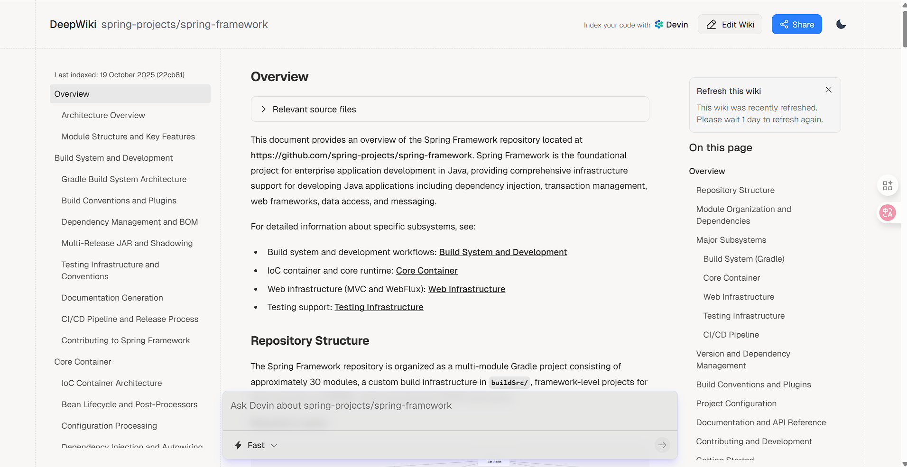
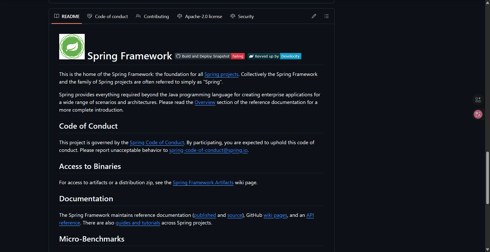
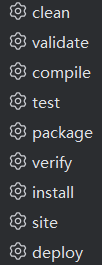
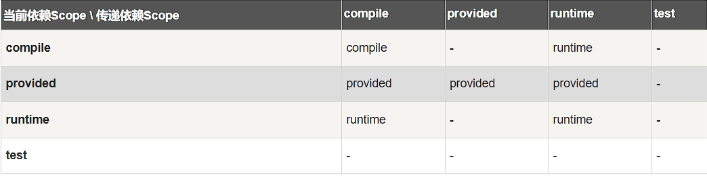
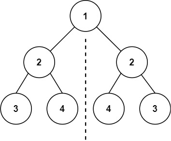

## 前言

本文是我自学时记录的笔记，有我个人的理解并部分地方调整过，并没有记录我认为不是我学习重心的内容，如有分歧请以具体课程内容为主。

---

## 1. 智能体工作流简介

### Non-Agentic vs Agentic Workflow

**Non-Agentic Workflow（非代理型）**

用 prompt 让 AI 去完成任务，一次性输出结果。

> 例：为我写一篇实验报告 → AI 思考后返回内容

**Agentic Workflow（代理型）**

LLM 执行多步操作来完成任务，具备迭代和自我修正能力。

> 例：为我写一篇实验报告 → 是否需要网络搜索 → 第一版草稿 → 判断哪些地方需要修改 → 重复直至完成任务



---

### 自主性程度

#### 低自主性



写一篇关于黑洞的论文 → LLM 进行网络搜索和抓取 → 写论文

特点：
- 所有步骤都是设定好的
- 工具都是硬编码
- 智能仅体现在文本生成

#### 高自主性



写一篇关于黑洞的论文 → LLM 进行网络搜索（决定从哪里获取资料、获取什么形式的资料）→ 抓取（抓取多少、是否需要格式转换）→ 写论文 → 反复审查

特点：
- 自主决定执行路径
- 能创建新工具

#### 对比



---

### 优势

1. 代理模式可以提高 AI 的性能
2. 通过并行加快速度

3. 允许增加或更新模块

---

### 任务分解：识别工作流中的步骤

构建初步工作流 → 表现不好 → 细化操作流程

---

### 智能体评估

常规做法：先构建系统 → 检查输出 → 修复漏洞 → 添加评估来检测是否修复

**问题**：有些情况难以用代码进行检测

**解决**：用智能体进行评估计分

---

### 设计模式

1. **Reflection**（反思）
2. **Tool Use**（工具使用）
3. **Planning**（规划）
4. **Multi-Agent Collaboration**（多智能体协作）

---

## 2. Reflection 反思

### 与直接输出相比的优势

直接输出是一次性生成；Reflection 让 AI 对自己的输出进行审视和改进，类似于人类写完文章后的自我检查。

### 如何正确评估

给出具体细分的标准，二元/多元计分，比较分数总和。

**为什么不直接选择？**
→ AI 倾向于选择第一个选项（位置偏差）

**为什么要多元化标准？**
→ 单一标准校准不佳，细分维度后评估更准确

### 外部反馈

在大模型进行工作时，提供正确的输出作为参考，或对它的错误进行指正。

---

## 3. Tool Use 工具使用


### 概念

大模型不实际调用工具，而是去**请求**工具。LLM 生成工具调用的意图，由外部系统负责实际执行。

### 工具语法

Tool Use 的核心流程：**定义工具 → LLM 生成调用请求 → 外部系统执行 → 结果返回给 LLM**

#### 1. 定义工具（Tool Definition）

以 JSON Schema 的形式告诉 LLM 有哪些工具可用：

```json
{
  "type": "function",
  "function": {
    "name": "get_weather",
    "description": "获取指定城市的当前天气信息",
    "parameters": {
      "type": "object",
      "properties": {
        "city": {
          "type": "string",
          "description": "城市名称，如：北京"
        },
        "unit": {
          "type": "string",
          "enum": ["celsius", "fahrenheit"],
          "description": "温度单位"
        }
      },
      "required": ["city"]
    }
  }
}
```

关键字段：
- `name`：工具名称，LLM 通过它来调用
- `description`：描述工具的用途，帮助 LLM 判断何时使用
- `parameters`：参数的 JSON Schema，定义输入格式

#### 2. LLM 生成工具调用（Tool Call）

当 LLM 判断需要使用工具时，它不会直接执行，而是返回一个结构化的调用请求：

```json
{
  "tool_calls": [
    {
      "id": "call_abc123",
      "type": "function",
      "function": {
        "name": "get_weather",
        "arguments": "{\"city\": \"北京\", \"unit\": \"celsius\"}"
      }
    }
  ]
}
```

#### 3. 外部系统执行并返回结果

应用程序拿到调用请求后，实际执行函数，再把结果喂回给 LLM：

```json
{
  "role": "tool",
  "tool_call_id": "call_abc123",
  "content": "{\"temperature\": 22, \"condition\": \"晴\"}"
}
```

#### 4. LLM 基于结果生成最终回复

> "北京现在 22°C，天气晴朗。"

整个过程中 LLM 本身不执行任何代码，它只负责**决定调什么工具、传什么参数**，实际执行权在应用层。

### MCP（Model Context Protocol）

MCP 是 Anthropic 提出的开放协议，目的是**统一 LLM 与外部工具/数据源的连接方式**。

解决的问题：每个工具提供商都有自己的接入方式，LLM 应用需要为每个工具单独写适配代码。MCP 就像 USB 接口一样，定义了一套标准协议，让任何工具只要实现 MCP Server，就能被任何支持 MCP 的 LLM 客户端调用。

核心架构：

```
LLM 应用（MCP Client）  ←→  MCP Server（工具/数据源）
```

- **MCP Client**：嵌入在 LLM 应用中，负责发现和调用工具
- **MCP Server**：封装具体工具的能力，暴露标准化接口

与普通 Function Calling 的区别：
- Function Calling 是一次性定义好工具列表，写死在代码里
- MCP 是动态发现，LLM 可以在运行时连接新的工具服务器，获取更多能力

---

## 4. 使用技巧

### 构建 MVP（Minimum Viable Product，最小可行产品）

在构建 Agent 系统时，不要一开始就追求完美，先搭一个最小可行版本：

- 仅保留最核心功能，剔除所有非必需代码/依赖
- 能完整跑通主要业务流程，无关键缺失
- 可直接运行、测试或交付给早期用户/验证想法
- 常用于敏捷开发、快速原型验证、教学示例或初创项目

> 先让它跑起来，再让它跑得好。

### 进行错误审查

当 Agent 输出不符合预期时，不要直接改 prompt 碰运气，而是：

1. 把 Agent 的中间过程完整打印出来（每一步的输入输出）
2. 逐步检查，定位到具体是哪一步出了问题
3. 针对性地修复那一步，而不是全局调整

这和 debug 代码的思路一样：先定位，再修复。

### 评估优化

为 Agent 的每个模块单独构建评估方法：

- **搜索模块**：返回的结果是否相关？覆盖率如何？
- **摘要模块**：是否丢失关键信息？是否引入幻觉？
- **决策模块**：选择的工具是否合理？参数是否正确？

针对性评估比端到端评估更容易发现问题，也更容易迭代优化。

---

## 5. 多智能体

### 为什么要用多智能体

单个 Agent 处理复杂任务时会遇到瓶颈：

- **上下文窗口有限**：一个 Agent 塞太多职责，prompt 会变得又长又混乱
- **专业化更高效**：就像公司里有不同岗位，让每个 Agent 专注一件事，效果更好
- **并行处理**：多个 Agent 可以同时工作，提高整体速度
- **易于调试**：出问题时能快速定位是哪个 Agent 的责任

> 类比：一个人既当产品经理又当开发又当测试，不如三个人各司其职。

### 多智能体的通信模式

#### 1. 顺序传递（Pipeline）

```
Agent A → Agent B → Agent C → 最终输出
```

每个 Agent 处理完后把结果传给下一个。适合流程明确的任务，比如：研究 → 写作 → 审校。

#### 2. 分层委派（Hierarchical）

```
        Supervisor Agent
       /       |        \
  Agent A   Agent B   Agent C
```

一个主管 Agent 负责分配任务、汇总结果。适合需要协调和决策的场景。

#### 3. 协作讨论（Debate/Discussion）

```
Agent A ←→ Agent B ←→ Agent C
         (多轮对话)
```

多个 Agent 互相讨论、质疑、补充，最终达成共识。适合需要多角度分析的复杂问题。

#### 4. 广播模式（Broadcast）

```
Orchestrator → 同时通知所有 Agent → 收集结果 → 合并
```

适合可以并行处理的独立子任务。

---

## 6. 知识图谱

### 概念

知识图谱解决的核心问题：**让 AI 理解实体之间的关系**。

传统数据库存储的是表格数据（行和列），而知识图谱存储的是**实体（节点）和关系（边）**，形成一张网络。

> 例：「吴恩达」—[创办]→「DeepLearning.AI」—[提供]→「AI Agent 课程」

### 为什么 Agent 需要知识图谱

- LLM 的知识是静态的（训练时截止），知识图谱可以提供实时更新的结构化知识
- 复杂推理需要多跳关系（A 认识 B，B 在 C 公司工作，所以 A 可能了解 C 公司），图谱天然支持这种查询
- 减少幻觉：有明确的事实依据，而不是让 LLM 凭记忆回答

### 模式查询

使用知识图谱时的核心思考框架：

1. **目标是什么** — 要回答什么问题？需要找到什么实体或关系？
2. **什么样的数据是有效的** — 图谱中哪些节点和边与问题相关？如何过滤噪声？
3. **数据被怎样分析** — 用什么查询模式？单跳查询还是多跳推理？是否需要聚合？

常见查询语言：**Cypher**（Neo4j）、**SPARQL**（RDF 图谱）

```cypher
// Cypher 示例：查找吴恩达创办的所有组织
MATCH (p:Person {name: "吴恩达"})-[:FOUNDED]->(org:Organization)
RETURN org.name
```
